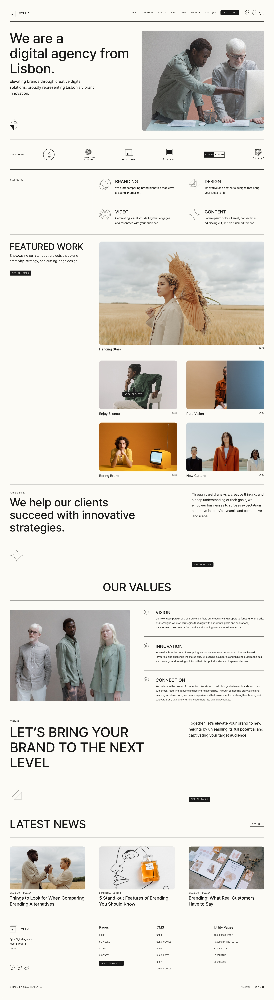
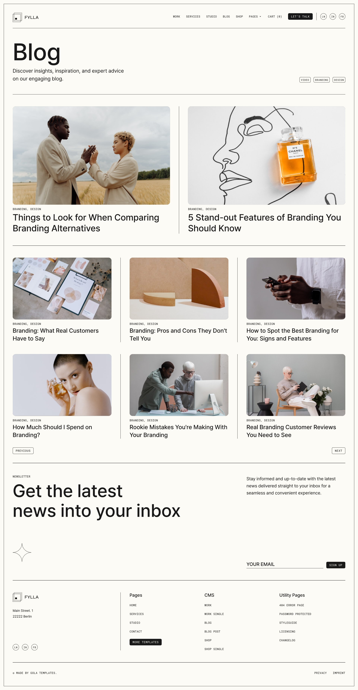
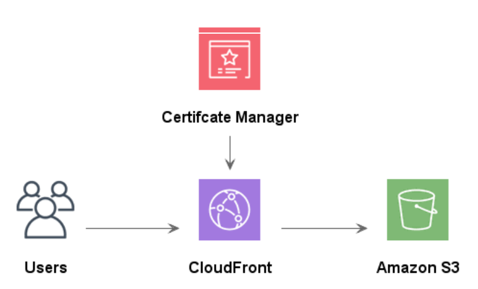

# magazine-in-lapidem

매거진 페이지를 구현하고, AWS를 통해 배포한 서비스 입니다.

## Introduction

배포 주소: https://d3p8thwnimt9c5.cloudfront.net/index.html

## Tech Stacks

### Front-End

### Distribution

### Communication

### Environment

## Screens

|                             메인 페이지                             |                          서비스 페이지                           |
| :-----------------------------------------------------------------: | :--------------------------------------------------------------: |
|  |  |

|                         스튜디오 페이지                         |                         블로그 페이지                         |
| :-------------------------------------------------------------: | :-----------------------------------------------------------: |
|  |  |

## Cloud Architecture

- AWS CloudFront
- Amazon S3
- AWS Certificate Manager

## Others

### Period

2024.04.22 - 23 (2 days)

### Members

|                                      최경서                                      |                                      김현아                                       |
| :------------------------------------------------------------------------------: | :-------------------------------------------------------------------------------: |
|  |  |
|                  [@kyeongseo90](https://github.com/kyeongseo90)                  |                     [@hyuna333](https://github.com/hyuna333)                      |

### Coworking Rules

- commit 자주 날리기
- commit convention
  - feat: 새로운 기능
  - fix: 버그 수정
  - docs: 문서 변경
  - style: EOL, 세미콜론 등 코드에 대한 변경이 아닌 컨벤션에 관련된 변경
  - refactor: 프로덕션 코드 리팩토링
  - test: 테스트 추가, 리팩토링 테스트 ( 프로덕션 코드 변경 없음 )
  - chore: 빌드, 릴리즈, 설정 등의 변경 ( 프로덕션 코드 변경 없음 )
- CC: 한국말 설명
- 함수명(클래스, 아이디) : 케밥 케이스
- 브랜치명: feat/페이지 명
- 상대방 PR comments 달아주기
